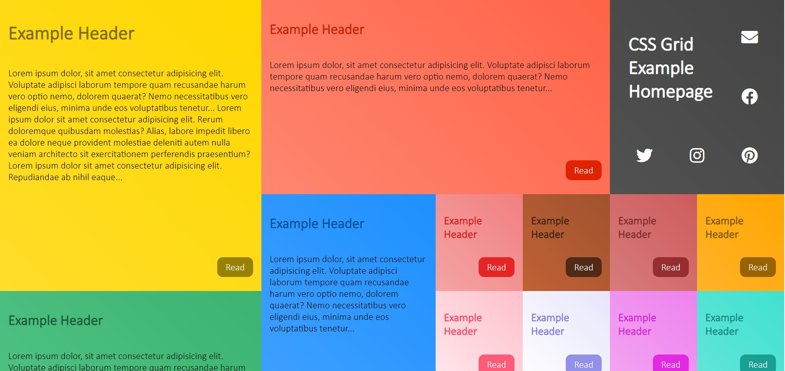
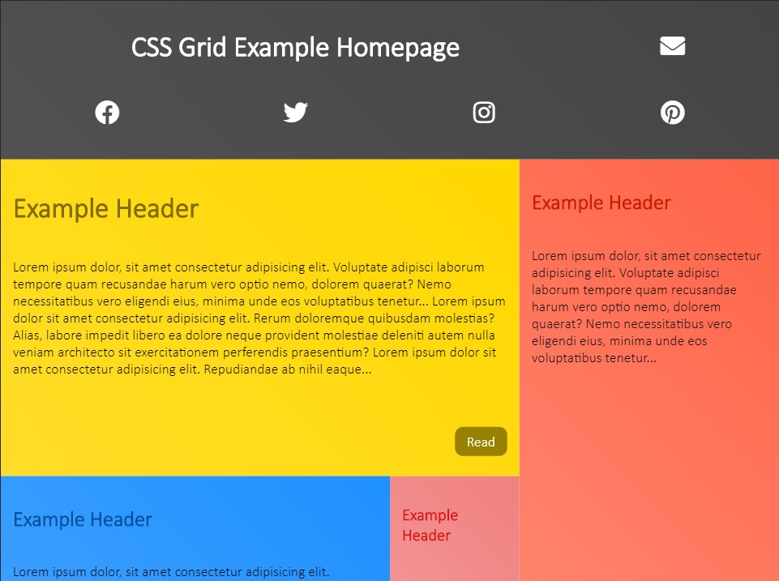
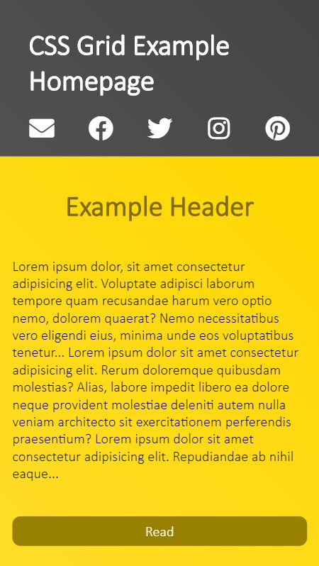

CSS Grid Blog Homepage Example
=================================================================

[View the live website](https://css-grid-blog-homepage-example.netlify.com/)

Experiments in using CSS grid to create responsive websites

Development
-----------------------------------------------------------------

Make sure your environment is configured to development mode.

This project uses Grunt as it's main task runner.

Type `npm install` to install Grunt and other dependencies.

### Build the Project

If you're on npm 5.2 or higher, type `npx grunt`.

Otherwise, type `./node_modules/.bin/grunt`.

You can also use `grunt build`, which does the same thing.

### Run the Dev Server

If you're on npm 5.2 or higher, type `npx grunt devserver`.

Otherwise, type `./node_modules/.bin/grunt devserver`.

This will also run grunt watch, so the webpage will livereload
when you make changes.

---------------------------------------------------------------------------------

_Created by Anshul Kharbanda (andydevs)_